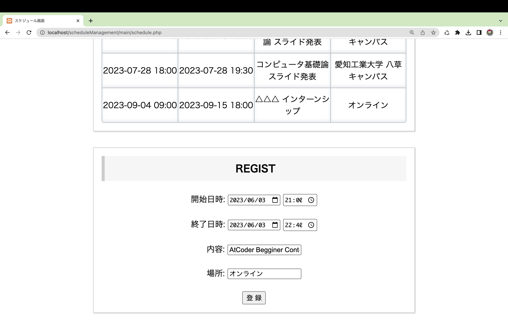

# ScheduleManagement

このWebアプリケーションはユーザーごとにスケジュールを管理します。
登録したスケジュールは「すべて」、「週ごと」、「月ごと」に表示可能であり、確認したいスケジュールを素早く表示できます。
また、表示されたスケジュールをクリックすることで、編集や削除が簡単に行えます。

# 使い方

## ログイン

<strong>ユーザー名</strong>と<strong>パスワード</strong>を入力してください。 
この際、すでに使用されているユーザー名は使用できません。 
また、パスワードの入力が間違っている際には登録ができません。

***

登録した<strong>ユーザー名</strong>と<strong>パスワード</strong>を入力してください。 
入力内容が正しければログインが完了します。 

***

## スケジュールの登録

登録したいスケジュールの内容を入力してください。 
登録内容はスケジュールの<strong>開始日時</strong>、<strong>終了日時</strong>、<strong>内容</strong>、<strong>場所</strong>です。 

***

## スケジュールの表示

登録したスケジュールは上記のように表示されます。 
表示方法には<strong>すべて</strong>、<strong>週ごと</strong>、<strong>月ごと</strong>に表示することが可能です。 
これによって、見つけたいスケジュールを素早く探して表示できます。 

***

## スケジュールの編集と削除

表示されているスケジュールをクリックすることで編集と削除ができます。 

***

# データベース設計

※ 使用する際は<strong>scheduleManagement.sql</strong>を実行してください

## データベース名　schedule_management

### memberテーブル

| Column | Type | Key |
| :---:| :---: | :---: |
| username | varchar(100) | PRI |
| password | varchar(640) |  |

### scheduleテーブル

| Column | Type | Key |
| :---:| :---: | :---: |
| id | int | PRI |
| username | varchar(100) |  |
| start | datetime |  |
| finish | datetime |  |
| contents | varchar(150) |  |
| place | varchar(150) |  |

* id：AUTO_INCREMENT
